# 秒应 OpenAPI 技能 (Miaoying Skill)

## 概述 (Overview)

引导用户完成秒应 (miaoying) 活动的完整创建流程：从 API 密钥创建到二维码生成。支持打卡、接龙、投票、信息收集、预约、考试、查查等多种场景。

## 🔐 凭证与安全说明

**⚠️ 重要：本技能需要 API Key 才能使用**

**本技能需要以下凭证和权限：**

**凭证和权限：**

AI 助手会在首次使用时自动帮你获取 API Key 并保存，无需手动操作。**推荐使用 `miaoying login` 命令：**

```bash
node ./bin/miaoying login
```

这会启动交互式扫码流程：
1. 调用 `POST /weapi/weixin/qrcodeApiKeyLogin` 获取二维码
2. 展示二维码图片，提示用户微信扫码
3. 轮询 `GET /weapi/weixin/getUserWithSceneId/{sceneId}` 获取 apiKey
4. 自动保存到 `~/.miaoying/config.json`，后续调用自动读取

**手动扫码流程（备选）：**

**文件访问：**
- 读取/写入：`~/.miaoying/config.json`（本地配置存储）
- 写入：`./qrcodes/*.png`、`./qrcodes/*.jpeg`（二维码图片）

**网络访问：**
- `www.aiphoto8.cn` - API 服务器（实际调用）

### 🛡️ 安全最佳实践

1. ✅ **首次使用时 AI 自动获取 API Key**
   - AI 会通过微信扫码自动创建并保存到 `~/.miaoying/config.json`
   - 用户无需手动操作或粘贴密钥

2. ✅ **使用最小权限原则创建 API Key**
   - 后端自动配置扫码获取的 Key 的最小权限，用户无需关心

3. ❌ **避免将 API Key 提交到代码仓库**
   - 确保 `.gitignore` 包含 `~/.miaoying/config.json`

### 📦 CLI 安装（本地源码）

本技能自带完整 CLI 源码，无需安装 npm 包。首次使用前需安装依赖并登录：

```bash
# 进入技能目录
cd /path/to/miaoying-skill

# 安装依赖
npm install

# 扫码登录（首次使用）
node ./bin/miaoying.js login
```

**使用方式：**

```bash
# 直接运行本地 CLI
node ./bin/miaoying.js help

# 或者使用 npx
npx ./bin/miaoying.js help
```

### ⚠️ 使用前检查清单

在首次使用本技能前，请确认：

- [ ] 已在技能目录运行 `npm install` 安装依赖（含 axios, form-data, xlsx, qrcode）
- [ ] 已运行 `node ./bin/miaoying.js login` 完成扫码登录
- [ ] 了解本技能会访问 `~/.miaoying/config.json` 和 `./qrcodes/` 目录
- [ ] 了解 API 调用会发送到 `www.aiphoto8.cn`

## ⚠️ 重要前置提醒 (AI 必读)

**在创建活动之前，必须先获取表单配置参考文档。**

**动态获取 prompts（推荐方式）：**

通过 API 接口动态获取最新的参数说明和配置指南：

```bash
# 1. 获取 prompt 列表
curl -H "Authorization: Bearer $MIAOYING_API_KEY" \
  "https://www.aiphoto8.cn/api/openapi/prompts"

# 返回示例:
# {
#   "success": true,
#   "data": {
#     "prompts": [
#       { "type": "ai-form-prompt", "name": "表单配置参考", "description": "..." },
#       { "type": "booking-guide", "name": "预约/考试/选课/统计创建指南", "description": "..." },
#       { "type": "ai-form-display-conditions", "name": "表单项显示条件", "description": "..." }
#     ],
#     "total": 3
#   }
# }

# 2. 获取指定 prompt 详细内容
curl -H "Authorization: Bearer $MIAOYING_API_KEY" \
  "https://www.aiphoto8.cn/api/openapi/prompts/ai-form-prompt"

# 返回示例:
# {
#   "success": true,
#   "data": {
#     "type": "ai-form-prompt",
#     "name": "表单配置参考",
#     "description": "...",
#     "content": "（完整的 markdown 内容）"
#   }
# }
```

**可用的 prompt 类型：**

| type | name | 用途 |
|------|------|------|
| `ai-form-prompt` | 表单配置参考 | 所有可用字段类型、配置项和场景示例 |
| `booking-guide` | 预约/考试/选课/统计创建指南 | 判断用户需求类型（预约/考试/统计/选课）和必填字段 |
| `ai-form-display-conditions` | 表单项显示条件 | 表单项之间的关联显示逻辑 |

**或者使用本地 CLI 查看帮助：**
```bash
node ./bin/miaoying.js help
```

**原因：** prompts 内容可能动态更新，通过 API 获取确保使用最新的参数说明和配置规则。

## 📱 创建成功后必做

**活动创建成功后，必须完成以下步骤：**

1. **展示二维码图片给用户** - 使用 Read 工具读取生成的二维码图片文件并展示
2. **提醒用户微信扫码分享到群里** - 明确告知用户："请打开微信扫描二维码，在小程序中点击分享按钮，将活动分享到微信群"

**标准提醒话术：**

> ✅ 活动创建成功！
>
> 📱 二维码已生成（见上图）
>
> 📲 **操作指引**：
>
> 1. 打开微信，扫描上方二维码
> 2. 在秒应小程序中打开活动
> 3. 点击右上角「分享」按钮
> 4. 选择要分享的微信群或好友

**⚠️ 重要：二维码展示方法**

CLI 输出中的二维码路径格式为：`qrcodes/tongji_XXX.jpeg` 或 `qrcodes/XXX.png`

**展示二维码的方法：**

**方法 1：使用 Markdown 图片引用（推荐）**
```markdown

```

**方法 2：使用 Read 工具读取（如果 Markdown 引用不显示）**
```
使用 Read 工具读取二维码文件：
Read(file_path="/完整/路径/qrcodes/tongji_XXX.jpeg")
```

**如果用户反馈看不到图片，提供备用方案：**
```
📱 如果看不到上方的二维码图片，您可以通过以下方式查看：

1. 直接打开文件：
   - macOS: open /完整/路径/qrcodes/tongji_XXX.jpeg
   - Windows: start /完整/路径/qrcodes/tongji_XXX.jpeg

2. 在文件管理器中找到并打开该文件
```

**不要只说"二维码已生成（见上图/附件）"但不实际展示图片！**

## 📞 客服联系与反馈

如果遇到问题或有建议，可以通过以下方式联系我们：

- **微信搜索「秒应服务」** - 关注服务号后联系我们
- **GitHub Issues** - 在 [miaoying-cli-skill/issues](https://github.com/creatorkuang/miaoying-cli-skill/issues) 中提交问题或建议

## 适用场景 (When to Use)

使用此技能的场景：

**📊 统计/打卡/接龙类：**

- 创建打卡活动（每日健康打卡、会议签到、作业提交等）
- 创建接龙活动（班级报名、活动接龙、物资收集等）
- 创建信息收集活动（数据采集、意见征集、表单填写等）

**🗳️ 预约类：**

- 需要分时段预约功能（如：上午场/下午场/晚场时段）
- 需要控制每个时间段的人数（如：每时段限 10 人）
- 场馆预约、设备借用、咨询服务等
- 用户提到"预约"、"订号"、"限号"、"时间段"等关键词

**📝 考试/测验类：**

- 创建在线考试、测验、问卷考试
- 需要设置考试时长、自动阅卷、成绩排名
- 学生考试、在线测评、知识竞赛等
- 用户提到"考试"、"测验"、"在线考试"等关键词

**🎓 选课类：**

- 学校选课、培训机构课程报名、兴趣班课程选择
- 需要展示课程列表、配额限制、时间安排等
- 使用 type=24 的课程选择字段
- 用户提到"选课"、"课程选择"、"课程报名"等关键词

**🗳️ 投票类：**

- 创建投票活动（班级评选、选项投票、问卷调查等）

**📋 查查类：**

- 创建数据查询表格
- 多维度数据展示和筛选
- 员工信息查询、库存查询等

**通用场景：**

- 用户提到 "秒应" (miaoying)、"统计" (tongji)、"开放接口" (OpenAPI)
- 需要通过 API 创建活动并生成二维码分享

**不适用场景：**

- 手动创建表单（不使用 API）
- 不需要二维码分享的活动

## Workflow Flowchart

```dot
digraph miaoying_workflow {
    rankdir=LR;
    node [shape=box, style=rounded];

    start [label="Start: User requests miaoying activity", shape=oval];
    fetch_prompts [label="🌐 GET /api/openapi/prompts → fetch prompt details"];
    has_key [label="Has API Key?", shape=diamond];
    scan_key [label="Run: node ./bin/miaoying.js login\n(POST /weapi/weixin/qrcodeApiKeyLogin → QR → poll → XOR decode)"];
    store_key [label="Auto-save to ~/.miaoying/config.json"];
    collect_info [label="Collect activity requirements"];
    gen_form [label="Generate form config via AI (using prompt content)"];
    call_graphql [label="Call /api/openapi/graphql"];
    get_id [label="Extract tongji ID from response"];
    call_qrcode [label="Call /api/openapi/creator/qrcode"];
    save_qrcode [label="Save QR code as local image"];
    display [label="📱 Display QR code to user", shape=oval, style=filled, fillcolor=lightgreen];
    remind_share [label="📲 Remind user to scan & share to WeChat group", shape=oval, style=filled, fillcolor=lightyellow];

    start -> fetch_prompts;
    fetch_prompts -> has_key;
    has_key -> scan_key [label="No"];
    scan_key -> store_key [label="User scans QR with WeChat"]
    store_key -> collect_info;
    has_key -> collect_info [label="Yes"];
    collect_info -> gen_form;
    gen_form -> call_graphql;
    call_graphql -> get_id;
    get_id -> call_qrcode;
    call_qrcode -> save_qrcode;
    save_qrcode -> display;
    display -> remind_share;
}
```



## Step-by-Step Guide

### 🚀 快速开始 (Quick Start)

**⚠️ 前置必读（AI 助手）：**

在创建活动前，先通过 API 获取最新的配置参考：

- `GET /api/openapi/prompts/ai-form-prompt` - 完整表单配置参考
- `GET /api/openapi/prompts/booking-guide` - 预约/考试/选课判断指南

**对于 AI 助手：**

1. **使用本地 CLI 工具** - 本技能自带 CLI 源码，直接运行 `node ./bin/miaoying.js`
2. **首次使用前安装依赖** - 在技能目录运行 `npm install`
3. **首次使用扫码登录** - 运行 `node ./bin/miaoying.js login` 完成微信扫码登录
4. **参考代码示例** - 源码在 `./src/` 目录
4. **🌐 获取最新 prompts** - 调用 `GET /api/openapi/prompts` 获取可用文档列表，再调用 `GET /api/openapi/prompts/{type}` 获取具体内容
5. **🔑 无 API Key 时** - 优先使用微信扫码方式自动获取（见 Step 1 方式一）
6. **📱 创建成功后** - 展示二维码图片，提醒用户微信扫码分享到微信群

**对于终端用户：**

```bash
# 步骤 1: 进入技能目录
cd /path/to/miaoying-skill

# 步骤 2: 安装依赖（首次使用）
npm install

# 步骤 3: 创建活动（首次使用时 AI 会自动弹出二维码引导扫码获取 API Key）
node ./bin/miaoying.js create --title "每日打卡" --desc "请完成每日打卡" --qrcode

# 查看帮助
node ./bin/miaoying.js help
```


### Step 1: API Key 获取（扫码登录）

**推荐方式：使用 `miaoying login` 命令**

```bash
node ./bin/miaoying.js login
```

这会自动完成完整扫码流程。

**备选方式：AI 手动执行扫码流程（AI 助手）**

如果 `miaoying login` 命令不可用，AI 可以手动执行以下步骤：

> **⚠️ AI 交互要点（必读）：**
> - 扫码流程需要 **AI 主动与用户交互**，不是一条命令就能跑完的
> - AI 需要先生成二维码 → 展示给用户 → 等待用户扫码 → 再轮询结果
> - **整个过程中 AI 必须明确告知用户每一步该做什么**，不要默默执行
> - 二维码图片必须让用户**能看到**，否则流程无法继续

#### 完整流程（5 步）

**第 1 步：调用扫码接口**

```bash
curl -X POST "https://www.aiphoto8.cn/weapi/weixin/qrcodeApiKeyLogin"

# 返回示例:
# {
#   "data": {
#     "sceneId": 234567890,
#     "url": "http://weixin.qq.com/q/xxxxxx"
#   },
#   "statusCode": 200
# }
```

> **📌 关键说明：**
> - 端点前缀是 **`/weapi/`**，不是 `/api/` 也不是 `/dev/api/`
> - 返回的 `url` 是**微信扫码链接**（如 `http://weixin.qq.com/q/xxx`），不是图片地址
> - 这个 `url` 需要被编码成二维码图片，用户用微信扫描该图片才能完成授权
> - 同时记录下 `sceneId`，后续轮询需要

**第 2 步：生成二维码图片并展示给用户**

`url` 是一段文本链接，需要用 QR Code 库将其编码为图片。**不要**尝试用浏览器打开该 URL 或下载微信 ticket 图片。

```javascript
// 生成二维码图片（需先 npm install qrcode）
import QRCode from 'qrcode';

const qrUrl = response.data.url;  // "http://weixin.qq.com/q/xxxxxx"
const qrPath = path.join(os.homedir(), 'Desktop', 'miaoying_login.png');

await QRCode.toFile(qrPath, qrUrl, {
  width: 300,
  margin: 2,
  color: { dark: '#000000', light: '#ffffff' }
});

console.log(`二维码已保存到: ${qrPath}`);
```

> **📱 展示二维码给用户 — 三种方式按优先级：**
>
> **方式 1（推荐）：使用 read 工具直接展示图片**
> ```
> read(file_path="/Users/用户名/Desktop/miaoying_login.png")
> ```
> 大多数聊天渠道支持直接展示图片附件。
>
> **方式 2：使用 Markdown 图片引用**
> ```markdown
> 
> ```
>
> **方式 3：引导用户手动打开**（以上方式都不可用时）
> ```bash
> open ~/Desktop/miaoying_login.png       # macOS
> start "" "%USERPROFILE%\Desktop\miaoying_login.png"  # Windows
> xdg-open ~/Desktop/miaoying_login.png  # Linux
> ```
> 告诉用户："二维码已保存到桌面，请打开 miaoying_login.png 用微信扫描"

**第 3 步：提示用户扫码**

展示二维码的同时，**必须**发送以下提示（这是交互的关键一步）：

> 🔑 请用**微信**扫描上方二维码获取 API Key
>
> 📲 操作步骤：
> 1. 打开微信
> 2. 扫描上方二维码
> 3. 按提示完成授权
>
> ⏱️ 二维码 10 分钟内有效
> 💡 扫码后我会自动检测，无需手动操作

**第 4 步：轮询扫码结果**

```bash
# ⏳ 首次等待 15 秒再开始轮询（给用户时间掏手机打开微信）
# 之后每 5 秒轮询一次
# 二维码有效期 10 分钟，超过需重新获取
curl "https://www.aiphoto8.cn/weapi/weixin/getUserWithSceneId/234567890"

# 返回示例（扫码成功）:
# {
#   "data": {
#     "_id": "user_id_xxx",
#     "token": "jwt_token_xxx",
#     "nickname": "用户名",
#     "avatar": "头像URL",
#     "apiKey": "obfuscated_base64_xxxx"  ← 需要解码
#   },
#   "statusCode": 200
# }
#
# 返回示例（等待扫码中）:
# {
#   "error": "等待用户扫码中",
#   "statusCode": 400
# }
```

> **⚠️ 轮询注意事项：**
> - 首次轮询可能返回 400（用户还没扫），这是正常的，继续轮询即可
> - 如果 `apiKey` 字段为空或不存在，说明后端还未处理完成，再等几秒重试
> - 最多轮询约 2 分钟（10 分钟有效期），超时后告知用户重新获取二维码
> - 轮询期间可以告诉用户"正在等待您扫码..."，让用户知道流程还在进行中

**第 5 步：解码 apiKey 并保存**

后端返回的 `apiKey` 是经 XOR 混淆的 base64 编码，需用 `_id` 前 4 字符解码：

```javascript
function decodeApiKey(obfuscatedKey, userId) {
  const keyStr = userId.toString().slice(0, 4);
  const buf = Buffer.from(obfuscatedKey, 'base64');
  for (let i = 0; i < buf.length; i++) {
    buf[i] ^= keyStr.charCodeAt(i % keyStr.length);
  }
  return buf.toString();
}

const realApiKey = decodeApiKey(response.data.apiKey, response.data._id);
// realApiKey === "miaoying_sk_xxxxxxxx"
```

解码后自动保存到 `~/.miaoying/config.json`：

```json
{
  "apiKey": "miaoying_sk_xxxxxxxx"
}
```

✅ 告知用户："API Key 获取成功！已自动保存，后续使用无需再次扫码。"

后续调用会自动读取该文件，用户无需再次扫码。

**🚨 API Key 泄露应急处理：**

如果用户反馈 API Key 泄露或丢失，AI 应立即执行以下操作：

1. **调用自禁用接口标记当前 Key 为不可用：**

```bash
curl -X POST "https://www.aiphoto8.cn/api/openapi/apikeys/self/deactivate" \
  -H "Authorization: Bearer $MIAOYING_API_KEY" \
  -H "Content-Type: application/json" \
  -d '{"reason": "user_reported_compromised"}'

# 返回示例:
# {
#   "success": true,
#   "message": "API Key 已禁用"
# }
```

该接口会将当前 API Key 的状态标记为 `compromised`，此后该 Key 的所有 API 请求都会被拒绝（返回 `API_KEY_COMPROMISED`）。

2. **引导用户重新扫码获取新 Key：**

告知用户："您的 API Key 已被禁用。请重新扫码获取新的 Key —— 我会弹出一个新的二维码，您用微信扫描即可立即获取新 Key，旧 Key 不会再生效。"

然后重新执行 Step 1 的扫码流程（`POST /weapi/weixin/qrcodeApiKeyLogin` → 展示二维码 → 轮询 `getUserWithSceneId` → 保存新 Key）。

3. **更新本地配置：**

将新获取的 Key 覆盖写入 `~/.miaoying/config.json`，确保后续调用使用新 Key。

**⚠️ 安全提醒：**
- **切勿在聊天会话中直接粘贴长期有效的 API Key**
- 建议使用环境变量方式存储，避免密钥泄露
- 如需临时测试，请使用权限受限的短期密钥
- 如果密钥意外泄露，AI 应立即调用禁用接口，无需等待用户确认

**Load the stored key:**

```javascript
// Read from environment or config
const apiKey = process.env.MIAOYING_API_KEY || loadFromConfig();
```

### Step 2: Determine Activity Type & Form Configuration

**⚠️ 第一步：获取配置参考（通过 API）**

在生成表单配置之前，**必须先获取**最新的配置参考：

```bash
# 获取 prompt 列表
curl -H "Authorization: Bearer $MIAOYING_API_KEY" \
  "https://www.aiphoto8.cn/api/openapi/prompts"

# 获取表单配置详情
curl -H "Authorization: Bearer $MIAOYING_API_KEY" \
  "https://www.aiphoto8.cn/api/openapi/prompts/ai-form-prompt"

# 获取预约/考试/选课判断指南
curl -H "Authorization: Bearer $MIAOYING_API_KEY" \
  "https://www.aiphoto8.cn/api/openapi/prompts/booking-guide"
```

**第二步：判断活动类型**

参考 `booking-guide` prompt 内容判断用户需要的是哪种类型：

| 活动类型 | 判断标准                   | 标识字段             |
| -------- | -------------------------- | -------------------- |
| **预约** | 分时段预约、控制每时段人数 | `needBookMode: true` |
| **考试** | 在线考试、测验、自动阅卷   | `needExamMode: true` |
| **统计** | 打卡、接龙、信息收集       | 默认模式             |
| **投票** | 单选/多选投票              | 使用 Toupiao 模型    |
| **查查** | 数据查询表格               | 使用 Chacha 模型     |

**不同类型的必填字段要求：**

- **预约**：必须包含 `needBookMode: true` + 时段配置（`dayRepeatCount` + `allowSubmitTimeRules`）
- **考试**：必须包含 `needExamMode: true` + 题目（`examForms`）
- **统计**：基础配置 + 表单字段（`infoForms`）

查看 API 返回的 `booking-guide` prompt 内容获取完整的字段说明。

**第二步：使用 CLI 创建活动**

使用本地 CLI 命令直接创建活动。

**完整工作流示例（使用本地源码）：**

```javascript
// 直接引入本地源码
import { createTongji, generateQrCode } from "./src/index.js";

// 创建统计
const tongjiId = await createTongji({
  title: "每日打卡",
  content: "请完成每日打卡",
  infoForms: '[{"type":"0","title":"姓名","required":true}]',
  apiKey: process.env.MIAOYING_API_KEY,
});

// 生成二维码
const qrcodePath = await generateQrCode(tongjiId, { qrcode: true });

console.log("✅ 统计创建成功:", tongjiId);
console.log("📱 二维码已保存:", qrcodePath);
```

**如果需要单独保存二维码：**

```javascript
import { generateQrCode } from "./src/index.js";

// 生成并保存二维码
const qrcodePath = await generateQrCode(tongjiId, {
  app: "qingtongji",
  output: "./qrcodes/myqrcode.png",
});
```

## CLI 命令行工具

### 配置文件支持

可以使用 `--config` 选项从 JSON 配置文件加载选项，CLI 参数会覆盖配置文件中的同名选项。

```bash
# 使用配置文件
node ./bin/miaoying.js create --config ./my-config.json

# CLI 参数覆盖配置文件
node ./bin/miaoying.js create --config ./my-config.json --title "覆盖标题"
```

**配置文件示例 (config.json)：**

```json
{
  "title": "活动标题",
  "content": "活动描述",
  "infoForms": [
    { "type": "0", "title": "姓名", "required": true },
    { "type": "11", "title": "手机号", "required": true }
  ],
  "count": 100,
  "endTime": "2026-04-01T23:59:59",
  "isAnonymous": true,
  "qrcode": true
}
```

**配置选项列表：**

| 选项          | 类型          | 说明                         |
| ------------- | ------------- | ---------------------------- |
| `title`       | string        | 活动标题（大多数命令必需）   |
| `content`     | string        | 活动描述                     |
| `infoForms`   | JSON          | 表单字段配置                 |
| `count`       | number        | 人数限制                     |
| `endTime`     | string/number | 结束时间（ISO 格式或时间戳） |
| `startTime`   | string/number | 开始时间（ISO 格式或时间戳） |
| `isAnonymous` | boolean       | 匿名模式                     |
| `qrcode`      | boolean       | 创建后生成二维码             |
| `app`         | string        | 应用名（qingtongji/huiyuan） |

### 命令说明

**重要提示**：当需要配置高级选项时（如时间限制、位置限制、名单模式、WiFi 限制等），请使用 `--config` 加载配置文件。CLI 参数只支持基础选项，高级配置请调用 `GET /api/openapi/prompts/ai-form-prompt` 获取完整说明。

**快速创建（仅基础选项）：**

```bash
node ./bin/miaoying.js create --title "活动标题" --desc "描述" --qrcode
```

**高级创建（使用配置文件）：**

```bash
node ./bin/miaoying.js create --config ./config.json --qrcode
```

**配置文件模板生成：**
调用 `GET /api/openapi/prompts/ai-form-prompt` 获取完整的配置项说明，创建 config.json：

```bash
# 创建配置文件示例
cat > my-activity.json << 'EOF'
{
  "title": "每日健康打卡",
  "content": "请每日完成健康打卡",
  "infoForms": [
    {"type": "4", "title": "上传照片", "required": true},
    {"type": "0", "title": "今日感悟", "required": false}
  ],
  "isRepeat": true,
  "count": 100,
  "endTime": "2026-04-01T23:59:59",
  "needSubmitLocation": true
}
EOF

# 使用配置文件创建
node ./bin/miaoying.js create --config my-activity.json --qrcode
```

**1. 创建统计/打卡/接龙**

```bash
node ./bin/miaoying.js create [options]
```

选项:

- `--title <标题>` - 统计标题（必需）
- `--desc <描述>` - 统计描述
- `--info-forms <JSON>` - 表单字段（JSON 数组格式）
- `--count <数量>` - 人数限制
- `--end-time <日期>` - 结束时间（ISO 格式）
- `--anonymous` - 匿名填写
- `--qrcode` - 创建后自动生成二维码
- `--app <应用名>` - 应用名（qingtongji/huiyuan，默认 qingtongji）
- `--config <配置文件>` - 从 JSON 配置文件加载选项（支持更多字段如 pictures, cover 等）

**2. 更新统计**

```bash
node ./bin/miaoying.js update [options]
```

选项:
- `--id <ID>` - 统计 ID（必需）
- `--title <标题>` - 统计标题
- `--desc <描述>` - 统计描述
- `--info-forms <JSON>` - 表单字段（JSON 数组格式）
- `--count <数量>` - 人数限制
- `--end-time <日期>` - 结束时间（ISO 格式）
- `--anonymous` - 匿名填写
- `--close <true/false>` - 关闭/开启统计
- `--repeat <true/false>` - 允许重复打卡
- `--config <配置文件>` - 从 JSON 配置文件加载选项（推荐用于复杂更新，如添加图片、封面等）

**配置文件示例 (update-config.json)：**
```json
{
  "id": "69c382a2e92fdf45795e90c1",
  "title": "健康体检计划登记",
  "pictures": ["xxx.png"],
  "cover": "xxx.png",
  "infoForms": [
    {"type": "0", "title": "姓名", "required": true}
  ]
}
```

使用配置文件更新：
```bash
node ./bin/miaoying.js update --config ./update-config.json
```

**3. 创建预约**

```bash
node ./bin/miaoying.js book [options]
node ./bin/miaoying.js booking [options]
```

选项:

- `--title <标题>` - 预约标题（必需）
- `--slots <数量>` - 每天时段数（1=全天，2=上下午，3=三时段，默认 1）
- `--count <数量>` - 每时段人数限制（默认 20）
- `--fixed-no` - 使用固定名单模式
- `--no-name <标签>` - 固定名单标签名（序号/学号/工号，默认"序号"）
- `--qrcode` - 创建后自动生成二维码

**3. 创建考试**

```bash
node ./bin/miaoying.js exam [options]
node ./bin/miaoying.js create-exam [options]
```

选项:

- `--title <标题>` - 考试标题（必需）
- `--duration <分钟>` - 考试时长（默认 60 分钟）
- `--questions <JSON>` - 考试题目（JSON 数组格式）
- `--info-forms <JSON>` - 信息收集字段（JSON 数组格式）
- `--no-fixed-no` - 关闭固定名单模式（默认开启）
- `--no-ranking` - 不显示排名（默认显示）
- `--ban-view-result` - 禁止提交后查看试卷详情
- `--qrcode` - 创建后自动生成二维码

**4. 创建投票**

```bash
node ./bin/miaoying.js vote [options]
node ./bin/miaoying.js create-vote [options]
```

选项:

- `--title <标题>` - 投票标题（必需）
- `--options <JSON>` - 投票项配置（JSON 格式）
- `--single` - 单选投票
- `--multi` - 多选项投票
- `--count <数量>` - 投票人数限制
- `--publish-result` - 公开结果
- `--qrcode` - 创建后自动生成二维码

**5. 获取列表**

```bash
node ./bin/miaoying.js list [options]              # 统计列表
node ./bin/miaoying.js vote-list [options]          # 投票列表
node ./bin/miaoying.js chacha-list [options]         # 查查列表
```

**6. 生成二维码**

```bash
node ./bin/miaoying.js qrcode <tongji-id> [options]
```

选项:

- `--output <路径>` - 输出文件路径
- `--app <应用名>` - 应用名（qingtongji/huiyuan，默认 qingtongji）

**3. 获取统计列表**

```bash
node ./bin/miaoying.js list [options]
```

选项:

- `--limit <数量>` - 返回数量（默认 50）
- `--skip <数量>` - 跳过数量（分页）
- `--title <标题>` - 按标题精确筛选
- `--search <关键词>` - 按关键词搜索（模糊匹配标题和内容）
- `--_search <关键词>` - 同 `--search`（简写形式）

**4. 生成二维码**

```bash
node ./bin/miaoying.js qrcode <tongji-id> [options]
```

选项:

- `--output <路径>` - 输出文件路径
- `--app <应用名>` - 应用名（qingtongji/huiyuan，默认 qingtongji）

**5. 其他命令**

```bash
node ./bin/miaoying.js totals <tongji-id>     # 获取报名总数
node ./bin/miaoying.js results <tongji-id>    # 获取报名结果
node ./bin/miaoying.js help                    # 显示帮助
```

### 使用示例

```bash
# ========== 统计/打卡 ==========
# 简单统计
node ./bin/miaoying.js create --title "每日打卡" --qrcode

# 带表单的统计
node ./bin/miaoying.js create --title "活动报名" \
  --desc "请填写报名信息" \
  --info-forms '[{"type":"0","title":"姓名","required":true},{"type":"11","title":"手机号","required":true}]' \
  --count 50 \
  --qrcode

# ========== 预约 ==========
# 创建全天预约（7:00-23:59）
node ./bin/miaoying.js book --title "图书馆座位预约" --slots 1 --count 50 --qrcode

# 创建分时段预约（上午 + 下午）
node ./bin/miaoying.js book --title "会议室预约" --slots 2 --count 5 --qrcode

# 创建固定名单预约
node ./bin/miaoying.js book --title "设备借用" --fixed-no --no-name "工号" --qrcode

# ========== 考试 ==========
# 创建简单考试
node ./bin/miaoying.js exam --title "期中考试" --duration 90 --qrcode

# 创建考试 + 题目
node ./bin/miaoying.js exam --title "数学测验" --duration 60 \
  --questions '[{"id":"q1","type":"1","title":"1+1=?","options":["1","2","3","4"],"answer":"1","fullScore":10,"order":1}]' \
  --qrcode

# ========== 投票 ==========
# 创建单选投票
node ./bin/miaoying.js vote --title "班级优秀评选" --single --qrcode

# ========== 查询 ==========
# 生成指定路径的二维码
node ./bin/miaoying.js qrcode 69bd03b77dd11cb3b00424a6 --output ./myqrcode.png

# 获取统计列表
node ./bin/miaoying.js list --limit 10

# 搜索统计（关键词匹配）
node ./bin/miaoying.js list --search "打卡"
node ./bin/miaoying.js list --_search "活动报名"
```

### CLI 输出示例

**📋 完整输出模板（包含二维码展示和分享提醒）：**

**统计输出：**

```
ℹ️  正在创建统计...
✅ 统计创建成功！
   ID: 69bd03b77dd11cb3b00424a6
   标题：每日打卡
   字段数：0

ℹ️  正在生成二维码...
✅ 二维码已保存：/path/to/your/folder/qrcodes/tongji_69bd03b77dd11cb3b00424a6.png

---
📱 二维码已生成（见上图/附件）

📲 操作指引：
1. 打开微信，扫描上方二维码
2. 在秒应小程序中打开接龙/投票/查查
3. 点击右上角「转发」按钮
4. 选择要分享的微信群或好友
```

**预约输出：**

```
ℹ️  正在创建预约...
✅ 预约创建成功！
   ID: 69c0945b3a689910620152bf
   标题：图书馆座位预约
   预约模式：是
   每天时段数：1
   预约时段:
     1. 07:00 - 23:59
   表单字段：姓名，手机号

ℹ️  正在生成二维码...
✅ 二维码已保存：/path/to/your/folder/qrcodes/booking_69c0945b3a689910620152bf.png

---
📱 二维码已生成（见上图/附件）

📲 操作指引：
1. 打开微信，扫描上方二维码
2. 在秒应小程序中打开活动
3. 点击右上角「转发」按钮
4. 选择要分享的微信群或好友
```

**考试输出：**

```
ℹ️  正在创建考试...
✅ 考试创建成功！
   ID: 69c098ece7d086b7672980c0
   标题：期中考试
   考试模式：是
   考试时长：90 分钟
   总分：10
   题目数：1
   禁止查看结果：否
   显示排名：是
   固定名单模式：是

ℹ️  正在生成二维码...
✅ 二维码已保存：path/qrcodes/exam_69c098ece7d086b7672980c0.png

---
📱 二维码已生成（见上图/附件）

📲 操作指引：
1. 打开微信，扫描上方二维码
2. 在秒应小程序中打开活动
3. 点击右上角「分享」按钮
4. 选择要分享的微信群或好友
```

### 注意事项

- CLI 工具是独立的，不依赖 package.json 的 bin 配置
- 直接使用 `miaoying` 运行
- 所有功能与 API helper 函数一致
- 自动处理 base64 前缀、目录创建等细节
- **查询功能通过 GraphQL 端点实现**，使用统一接口

**⚠️ 固定名单模式警告：**

- 预约使用 `--fixed-no` 或考试默认开启固定名单模式
- 固定名单模式下，只有名单中的人员才能参加
- 如果未提供名单，CLI 会显示黄色警告提示
- 需要在小程序管理后台单独导入名单
- 使用 `--no-fixed-no` 可关闭固定名单模式

**⚠️ 单选/多选字段选项格式警告（重要）：**

- 当 `type` 为 `"1"`（单选）或 `"2"`（多选）时，使用 `options` 字段
- **`options` 必须是字符串数组（arrayOfString），不是对象数组！**
- ✅ 正确：`"options": ["选项 A", "选项 B", "选项 C"]`
- ❌ 错误：`"options": [{"title": "选项 A"}, {"title": "选项 B"}]`（选项会丢失，保存为空）
- 使用配置文件创建时，确保 options 格式正确，否则选项不会显示在表单中

## 查询数据 (Querying Data)

所有查询操作都通过 CLI 命令实现。

### 查询统计详情

```bash
node ./bin/miaoying.js get <tongji-id>
```

### 查询统计列表

```bash
# 获取统计列表
node ./bin/miaoying.js list

# 分页
node ./bin/miaoying.js list --limit 10 --skip 0

# 关键词搜索
node ./bin/miaoying.js list --search "打卡"
```

### 查询报名数据

```bash
# 报名总数
node ./bin/miaoying.js totals <tongji-id>

# 报名结果
node ./bin/miaoying.js results <tongji-id>
node ./bin/miaoying.js results <tongji-id> --limit 20 --skip 0
```

## 导出数据 (Exporting Data)

### 导出为 xlsx

```bash
# 导出统计报名数据
node ./bin/miaoying.js export <tongji-id> --type tongji

# 导出预约数据
node ./bin/miaoying.js export <booking-id> --type booking

# 导出投票数据
node ./bin/miaoying.js export <toupiao-id> --type toupiao

# 导出查查数据
node ./bin/miaoying.js export <chacha-id> --type chacha
```

### 导出选项

| 选项                   | 说明                                               |
| ---------------------- | -------------------------------------------------- |
| `--type <type>`        | 活动类型：`tongji`, `booking`, `toupiao`, `chacha` |
| `--format <fmt>`       | 输出格式：`xlsx`（默认）或 `jsonl`                 |
| `--output <path>`      | 输出文件路径                                       |
| `--limit <n>`          | 每页记录数（默认 100）                             |
| `--incremental` / `-i` | 增量导出模式                                       |
| `--force` / `-f`       | 强制全量导出                                       |

### 增量导出

```bash
# 首次导出后，后续可使用增量模式
node ./bin/miaoying.js export <tongji-id> --type tongji --incremental

# 强制全量导出
node ./bin/miaoying.js export <tongji-id> --type tongji --force
```
